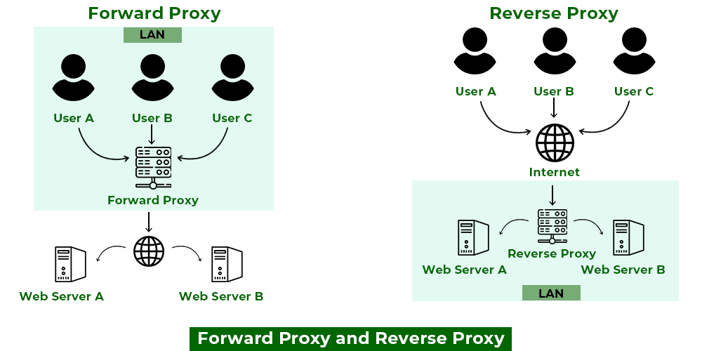
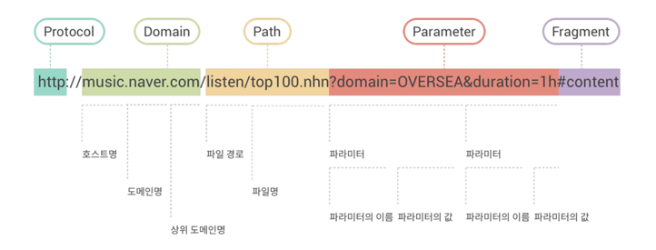
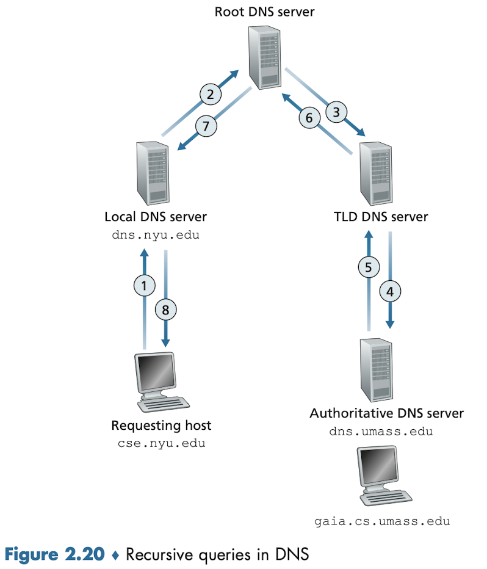

## 1. 프로토콜 - HTTP

### 1. HTTP/HTTPS

- **개념**
  - **H**yper**T**ext **T**ransfer **P**rotocol (하이퍼텍스트 전송 규약)
  - **client-server 간 통신을 위한 요청/응답 프로토콜**
  - HTTPS: **데이터 전송 전에 패킷을 암호화 →** 제3자가 가로챌 수 없도록 보안 강화(**S**ecure)
- **특징**
  - **무상태(stateless)**: server가 client의 이전 상태를 보존하지 않음
  - 비연결성(connectionless): client가 server에 요청하고 응답을 받으면 TCP/IP 연결 끊기<br/> ⇒ HTTP/1.1부터는 TCP/IP 연결을 재사용해 **지속 연결(persistent connection)**
- **비교**

  |  | HTTP | HTTPS |
  | --- | --- | --- |
  | 의미 | Hypertext Transfer Protocol | Hypertext Transfer Protocol Secure |
  | 기본 프로토콜 | - HTTP/1 및 HTTP/2: TCP/IP<br/>- HTTP/3: QUIC 프로토콜 | HTTP/2 + SSL/TLS |
  | 포트 | 기본 포트 80 | 기본 포트 443 |
  | 보안 | x | 퍼블릭 키 암호화에 SSL 인증서 사용 |
  | 이점 | 인터넷을 통한 통신 지원 | 신뢰성, SEO 개선 |

- **SSL/TLS 인증서란?**

  - SSL/TLS 프로토콜을 사용해 **암호화된 네트워크 연결을 설정할 수 있게** 함 ⇒ 즉 연결이 설정된 client-server만 전송한 데이터를 볼 수 있음
  - **네트워크 암호화 설정 과정**

    - 유저가 SSL/TLS 보안 웹 사이트(=https)에 접속
    - 브라우저가 서버의 진위 여부 확인을 위해 식별 가능한 정보를 요청
    - 서버가 암호화에 필요한 `퍼블릭 키`를 SSL/TLS 인증서에 담아 회신
    - 브라우저는 SSL/TLS 인증서가 유효한지 확인 (ex. 도메인 일치 여부, 만료 여부 등)
    - 유효하면 `퍼블릭 키`를 사용해 `비밀 세션 키`를 포함해 데이터를 암호화하여 전송
    - 서버는 브라우저가 보낸 데이터를 `프라이빗 키`로 복호화하고 세션 키를 꺼냄
    - 서버는 `세션 키`를 사용해 암호화하고 브라우저에 승인 메시지를 보냄
    - ⇒ 브라우저-서버가 동일한 `세션 키`를 사용하여 안전하게 통신

    ```
     💡 퍼블릭 키로 암호화한 파일은 프라이빗 키로만 복호화할 수 있고, 그 반대의 경우도 마찬가지이다. 해당 파일을 복호화할 수 있다는 것은, 수신자/발신자를 신뢰할 수 있음을 나타낸다.
    ```

    ```
    💡 세션 키는 초기 SSL/TLS 인증이 완료된 후, 브라우저와 서버 간 암호화된 통신을 유지한다. 세션 키는 암호화와 복호화에 동일한 키를 사용하는 대칭 암호화를 위한 키이다.
    비대칭 암호화(ex. 퍼블릭 키 암호화-프라이빗 키 복호화)는 계산 비용이 엄청나기 때문에, 인증이 완료된 이후부터는 계산이 덜 필요한 대칭 암호화로 전환하는 것이다.
    ```

### 2. HTTP/1.1, HTTP/2, HTTP/3

|          | 특징                                                 |
| -------- | ---------------------------------------------------- |
| HTTP/1.1 | 최초 표준 버전으로, 가장 기초적인 전송 형식이 확립됨 |
| HTTP/2   | - 전송 데이터 형식 변경: 텍스트 → 바이너리           |

- 다중화 프로토콜 ⇒ 동일한 연결을 통해 병렬 요청 수행이 가능
- 헤더 압축 ⇒ 오버헤드 제거 (기존: 데이터만 압축 가능)
- 서버 푸시 매커니즘: 서버가 클라이언트 캐시에 데이터 저장 가능 | | HTTP/3 | - 전송 계층 변경: TCP/IP → QUIC
- 업그레이드된 다중화 프로토콜: QUIC은 UDP를 통해 여러 스트림을 독립적으로 실행 ⇒ 오류 발생 시 해당 스트림만 차단 (HTTP/2의 다중화 프로토콜은 모든 스트림이 차단됨) |

```
💡 HTTP/2의 등장 배경

- 웹의 발전으로 주고받는 스크립트 코드 양이 증가
- ⇒ HTTP/1.1 연결에 복잡성과 오버헤드가 많이 발생
- ⇒ 2010년, Google이 SPDY라는 프로토콜 구현
  - HTTP/1.x 메시지를 프레임으로 나눠 스트림에 끼워넣고 여러 스트림을 하나로 묶음
  - ⇒ 중복 데이터 전송 문제 해결 & 데이터/헤더 분리로 인한 헤더 압축 가능
- ⇒ HTTP/2의 기반이 되어, 2015년 HTTP/2가 공식 표준화 됨
```

### 3. HTTP 메시지 프로토콜

- **요청 메시지**
  - 시작줄: `HTTP METHOD` + `요청 타겟` + `HTTP 버전`
  - 헤더: `Request 헤더` + `General 헤더` + `Representation 헤더`(본문이 있을 때만 존재)
  - 본문(optional)
- **응답 메시지**
  - 상태줄: `HTTP 버전` + `Status Code` + `Status Text`(순전히 사람을 위한 정보 제공 목적)
  - 헤더: `General 헤더` + `Response 헤더` + `Representation 헤더`(본문이 있을 때만 존재)
  - 본문(optional)

```
💡 페이로드(payload)는 전송되는 데이터 자체를 의미한다(=body에 담기는 데이터).
메시지에서 페이로드를 제외한 나머지 부분은 "프로토콜 오버헤드"에 해당한다.
```

### 4. HTTP METHOD

- 종류 및 역할

|  | 역할 | 멱등성(부수효과가 없는가?) |
| --- | --- | --- |
| GET | 리소스 주세요(Read) | O |
| POST | 리소스 받으세요 | X |
| PUT | 리소스 없으면 만들고, 있으면 바꿔주세요(Update) | O |
| PATCH | 리소스 여기만 바꿔주세요(Update) | X |
| DELETE | 리소스 삭제해주세요 | O |
|  |  |  |
| CONNECT | 양방향 연결 요청 (ex. HTTPS 접속 시) | X |
| HEAD | 응답 바디가 없는 GET (⇒검색/확인/검사용) | O |
| TRACE | 메시지 loop-back test (⇒디버깅/검사용) | O |
| OPTIONS | 서버가 지원하는 통신 옵션 정보 얻기(⇒예비요청용)<br/>(ex. HTTP 메소드, CORS 정책 정보 등 주세요) | O |

- `POST`의 역할
  - 리소스 조회(Read)
  - 리소스 제출 ⇒ 데이터 생성(Create) 여부는 서버 로직에 따르는 것 뿐임
    - ex. 게시글 등록, 파일 업로드, 로그인, form 제출, 상태 변경(ex. 결제완료)
- `GET` 조회 vs. `POST` 조회

|  | GET 조회 | POST 조회 |
| --- | --- | --- |
| 캐싱 여부 | 가능 ⇒ 속도 빠름 | 조건부 가능 |
| 보안 이슈 | 쿼리스트링이 URL에 노출됨<br/>(ex. `http://www.ex.com/search?&query=테스트...`) | 요청 데이터 노출 X |
| 복잡한 쿼리 처리 | 쿼리 파라미터가 복잡한 경우, URL 길이 제한에 걸릴 수 있음 | 쿼리 파라미터가 복잡해도 바디에 담아 전달하므로 문제 없음 |
| 잠재적 문제 | 사용자가 URL 쿼리를 수정해 요청을 생성하기 쉬움 | 그럴 일이 없음 |

### 5. HTTP Status Code를 종류별로 나누어 설명해주세요.

|      | 의미            | 해석                                     |
| ---- | --------------- | ---------------------------------------- |
| 100~ | 정보            | 요청 받았고 계속 진행할게.               |
| 200~ | 성공            | 요청 성공적으로 받았고 처리했어.         |
| 300~ | 리다이렉션      | 요청 완료를 위해 추가 작업이 필요해.     |
| 400~ | 클라이언트 에러 | 요청이 이상하거나 처리 불가능해.         |
| 500~ | 서버 에러       | 요청은 유효한데, 서버가 수행하지 못했어. |

### 참고

- [AWS HTTP와 HTTPS 비교](https://aws.amazon.com/ko/compare/the-difference-between-https-and-http/)
- [MDN HTTP 메시지](https://developer.mozilla.org/ko/docs/Web/HTTP/Messages)
- [🌐 HTTP 메서드 종류 & 요청 흐름 💯 총정리](https://inpa.tistory.com/entry/WEB-%F0%9F%8C%90-HTTP-%EB%A9%94%EC%84%9C%EB%93%9C-%EC%A2%85%EB%A5%98-%ED%86%B5%EC%8B%A0-%EA%B3%BC%EC%A0%95-%F0%9F%92%AF-%EC%B4%9D%EC%A0%95%EB%A6%AC#html_form_%EB%8D%B0%EC%9D%B4%ED%84%B0_%EC%A0%84%EC%86%A1_%EA%B3%BC%EC%A0%95)
- [Wikipedia HTTP 상태 코드](https://ko.wikipedia.org/wiki/HTTP_%EC%83%81%ED%83%9C_%EC%BD%94%EB%93%9C)

## 2. RESTful API

- **개념**
  - 모범적인 HTTP 프로토콜 사용을 위한 아키텍처
  - **RE**presentational **S**tate **T**ransfer
- **6가지 제한 조건**

|  | 의미 |
| --- | --- |
| 인터페이스 일관성 | 일관적인 형식(인터페이스)으로 정보를 전송해야 함 (\*아래 참고) |
| 무상태(Stateless) | 각 요청 간 클라이언트의 콘텍스트가 서버에 저장되어선 안 됨 |
| 캐싱 가능성 | 리소스를 캐싱할 수 있어야 함 |
| 계층 구조 아키텍처 | 클라이언트는 서버에 직접 연결되었는지 중간 서버를 통해 연결되었는지 몰라야 함 |
| client-server 구조 | 클라이언트/서버는 서로 독립적으로 분리되어야 함 |
| 온디맨드 코드 | 필요한 경우, 응답에 실행 코드를 포함할 수 있어야 함 |

- **_\*인터페이스 일관성을 위한 규칙_**
  - 요청 시 URI로 리소스 식별이 가능해야 함
  - 리소스 표현 시 리소스를 처리하는 데 필요한 정보를 충분히 포함해야 함(=자기서술적)
  - HTTP Method로 리소스에 대한 행위(조작)을 나타내야 함

## 3. 프록시(Proxy)란?

### 개념

- 사용자와 실제 서버 중간에서 요청/응답을 **대신 전달하는 통신 중개 서버**
- 유형 
  - **포워드 프록시**: 사용자 앞에 놓여, 사용자와 통신 ⇒ 사용자를 숨김
  - **리버스 프록시**: 서버 앞에 놓여, 내부망 서버와 통신 ⇒ 서버를 숨김, 캐싱, 서버 부하⬇️
- 대표적인 종류
  - DNS

### 프록시 서버 동작 방식

- 사용자가 웹 사이트에 주소를 입력
- `프록시 서버`가 진짜 웹 서버 대신 `사용자`의 요청을 받음
- `프록시 서버`가 해당 요청을 `웹 서버`로 전달함
- `웹 서버`가 응답을 `프록시 서버`로 전달함
- `프록시 서버`가 응답을 `사용자`에게 전달함

### 프록시 서버 사용 이유

- **보안 강화**: 사용자 또는 실제 서버의 IP를 숨겨 공격을 피함
- **캐시 사용**: 프록시 서버에 자주 사용한 데이터를 저장해 속도를 향상
- **로드 밸런싱**: 본 서버 앞에 리버스 프록시를 두어 대량의 트래픽이 와도 부하되지 않게 함
- **로그 관리**: 프록시 서버에 사용자 요청 기록이 남음 ⇒ 어떤 IP가 어떤 IP로 얼마나 접속했는지 확인
- **접속 우회**: 지역 IP가 차단된 경우, 프록시 서버를 사용해 다른 곳에서 접속한 것처럼 우회 가능

## 4. DNS

### 개념

- Domain Name System
- `도메인`과 `IP주소`의 맵핑 관계를 저장하는 거대한 분산 계층 DB 시스템
  - **분산**: DNS 서버는 1개가 아니라 여러 개이며 세부적인 역할이 다름
  - **계층**: 여러 DNS는 계층 구조를 이룸 (Root→TLD→SLD)

### URI 구성



- 도메인은 최상위 도메인(`.com`), 도메인 이름(`.naver`), 하위 도메인(`music`)으로 나뉨

### 구성

- **DNS Resolver**
  - 사용자와 DNS 네임서버 간 요청/응답 중개 서버
  - 쿼리 방식(아래 참조)에 따라 네임서버에 쿼리를 보내고, 획득한 IP 주소를 사용자에 응답함
  - 획득한 IP 주소를 캐시함
- **Root Name Server**
  - 모든 DNS 조회가 시작되는 DNS 최상단 계층 서버
  - 도메인을 해석해 TLD 서버 정보를 반환함
- **TLD(Top-Level Domain) Name Server**
  - 도메인 이름을 가지고 SLD 서버 정보를 반환함
- **SLD(Second-Level Domain) Name Server**
  - `도메인`과 `IP 주소`의 맵핑 관계를 저장하고 있는 서버
  - 도메인에 대한 IP 주소를 반환함
  - 하위 도메인 이름이 있으면(ex. `sub.example.com`) 추가적인 SLD 서버 정보를 반환함
  - 최종 결정 권한이 있어, **Authoritative Server**라고도 불림

### 동작 방식

- **Iterative Query**: IP 주소를 얻을 때까지 Root, TLD, SLD 네임서버에 순차적으로 쿼리를 보냄 
  1. 사용자가 주소창에 `example.com`을 입력 → 요청이 인터넷으로 이동해 DNS Resolver가 이를 수신
  2. **DNS Resolver**가 **Root Server**에 쿼리
  3. **Root Server**가 `com`을 관리하는 **TLD Server** 정보를 반환
  4. **DNS Resolver**가 `com` **TLD Server**에 쿼리
  5. **TLD Server**가 `example.com`을 관리하는 **SLD Server** 정보를 반환
  6. **DNS Resolver**가 `example.com` **SLD Server**에 쿼리
  7. **SLD Server**가 `example.com`의 IP 주소를 반환
  8. **DNS Resolver**가 해당 IP 주소를 브라우저에게 응답 (+ IP 주소 캐싱)
- **Recursive Query**: DNS 네임서버 간 재귀적으로 쿼리를 보냄 
  ```
  💡 성능 측면에서는 Iterative Query보다 빠르지만, **보안에 취약**하여 권장되지 않는다.
  가령 중간에 위치한 DNS 서버가 악성 코드나 위조된 DNS 서버 정보를 제공한다거나, 제3자가 사용자의 트래픽을 가로채고 조작할 수 있다.
  ```

### 참고

- [cloudflare DNS란](https://www.cloudflare.com/ko-kr/learning/dns/what-is-dns/)
