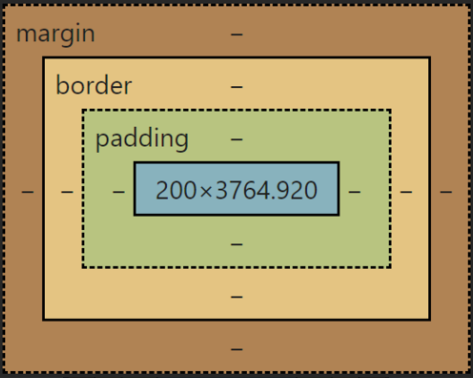
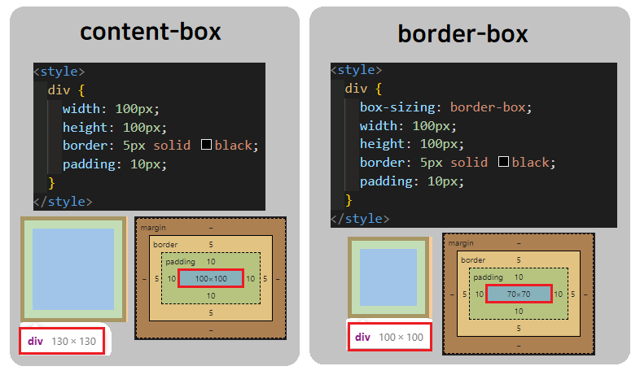

## 1. position 속성에 대해 설명해주세요.

```
💡 `position` 속성은 요소를 어디에 어떻게 배치할지 지정할 때 사용합니다.
`static`은 요소를 원래 위치에 배치하고, `relative`는 원래 위치에 오프셋을 적용하여 배치합니다. `absolute`는 `position`이 `static`이 아닌 상위 요소 위치에 오프셋을 적용하여 배치합니다.
`fixed`는 화면 상의 특정 위치에 요소를 고정하고 싶을 때 사용하고, `sticky`는 스크롤했을 때 특정 위치에 요소를 부착시키고 싶을 때 사용합니다.
```

- **개념**

  - 문서 상에 요소를 배치하는 방법을 지정

- **종류 및 특징**

  |  | `static` | `relative` | `absolute` | `fixed` | `sticky` |
  | --- | --- | --- | --- | --- | --- |
  | 설명 | 기본값 | 원래 요소가 있어야 할 위치에 상대적으로 배치함 | 특정 요소에 상대적으로 배치함 | 요소가 화면의 특정 위치에 고정되어 움직이지 않게 함 | 화면 스크롤 시, 요소가 특정 위치에 달라붙어 움직이지 않게 함 |
  | 문서 흐름에 따름 | O | O | X (문서로부터 독립) | X (문서로부터 독립) | O |
  | 배치 기준 | 원래 위치 | 원래 위치 + 오프셋 | `position`이 `static`이 아닌 가장 가까운 상위 요소 (or `<body>`) 위치 + 오프셋 | 뷰포트 + 오프셋 | 스크롤 가능한 가장 가까운 상위 요소 + 오프셋 |
  | 예시 |  |  |  | 웹사이트 오른쪽 아래에 둥둥 떠있는 "채팅 상담" 버튼 | 화면 상단에 붙는 메뉴/헤더 박스 |

## 2. display 속성에 대해 설명해주세요.

```
💡 `display` 속성은 요소를 어떻게 표시할 것인지 그 유형을 정의할 때 사용됩니다.
```

- **개념**
  - 화면에 요소를 어떻게 표시할 것인지 정함
- **종류 및 특징**
  - `inline` (default)
    - 자기 자신만큼의 공간만 차지
      - `width`, `height` 지정할 수 X
      - `margin`, `padding` 좌우 간경에만 반영 O, 상하 간격에는 반영 X
    - 예시: `<span>`, `<a>`, ``, `<b>`, `<i>`
  - `block`
    - 자기가 속한 영역의 가로 영역을 모두 차지
      - ⇒ 전후의 다른 요소들을 모두 밀어냄(=줄바꿈)
    - 예시: `<div>`, `<p>`, `<h1>`
  - `inline-block`
    - 외부적으로는 `inline` 요소, 내부적으로는 `block` 요소
    - 인라인 레벨 요소처럼 동작 (전후 요소를 줄바꿈하지 X)
    - but 블록 레벨 요소의 속성을 적용 O
      - `width`, `height` 지정 O
      - `margin`, `padding` 상하 간격도 반영 O
    - 예시: `<button>`, `<input>`, `<select>`
  - `none`
    - 요소를 렌더링하지 않음
    - 요소가 영역을 차지하지 않음
  - `flex`
    - 가로 혹은 세로로 이루어진 레이아웃
  - `grid`
    - 열과 행으로 이루어진 레이아웃

## 3. box model이란?

```
💡 박스 모델(Box Model)이란, 요소가 차지하는 사각형 형태의 영역을 말합니다. 박스 모델은 content와 padding, border, margin으로 구성되어 있습니다.
```



- **개념**
  - 요소가 차지하는 사각형 형태의 영역
  - 박스 모델 구성 요소
    - `content`: 콘텐츠 크기(width \* height)
    - `padding`: 안쪽 여백
    - `border`: 외곽선
    - `margin`: 바깥쪽 여백

## 4. `box-sizing`에 대해 설명해주세요.

```
💡 `box-sizing`은 박스의 크기를 어떻게 계산할 것인지 결정하기 위한 속성입니다.
`box-sizing`값이 `content-box`이면 콘텐츠를 기준으로 크기가 적용되고, `border-box`이면 마진을 제외한 박스 영역을 기준으로 크기가 적용됩니다.
```

- **개념**
  - 박스의 크기를 계산하는 방법을 지정함
- **종류**
  - `content-box` (default)
    - 크기 = 콘텐츠영역
    - width, height 지정 시, content 크기를 해당 넓이, 높이로 지정함
  - `border-box`
    - 크기 = 콘텐츠영역 + 안쪽 여백(padding값) + 테두리(border-width값)
    - width, height 지정 시, 요소 전체의 크기를 해당 넓이, 높이로 고정함
- **기타**
  - 🚨 바깥쪽 여백(margin값)은 포함 X, 다른 요소와 거리를 벌리는 용도



## 5. 마진 상쇄(margin Collapsing)가 왜 일어나는지, 해결방법?

```
💡 마진 상쇄란 블록 레벨 요소와 요소 간 상하 마진이 서로 인접할 때, 가장 큰 마진 하나로 통합되는 현상입니다. 마진 상쇄는 블록 레벨 요소에만 적용되는 현상이므로 `display: inline-block`을 통해 해결할 수 있습니다.
```

- **개념**
  - 여러 **블록 레벨 요소**의 **상하 마진**이 브라우저 상에서 가장 큰 하나의 마진으로 결합(상쇄)되는 현상
- **마진 상쇄가 일어나는 3가지 상황**
  - **인접 형제 요소 간**
    - `A-B`처럼 요소가 있을 때,
    - ⇒ `A`의 아래쪽 마진과 `B`의 위쪽 마진끼리 상쇄
  - **빈 요소**
    - 높이, padding, border 등 상하로 늘어나는 속성 값이 없는 요소
    - 내부에 inline 콘텐츠가 존재하지 않는 요소
    - ⇒ 위아래 경계를 나눌 수 없음 ⇒ 자신의 상하 마진끼리 상쇄
  - **부모 요소와 자식 요소 간**
    - `부모-자식A-자식B` 처럼 요소가 있을 때,
    - ⇒ `부모`의 위쪽 마진과 첫번째 자식인 `자식A`의 위쪽 마진끼리 상쇄
    - ⇒ `부모`의 아래쪽 마진과 마지막 자식인 `자식B`의 아래쪽 마진끼리 상쇄
- **해결 방법**
  - `display: inline-block`으로 지정 (모든 경우에 적용 가능)
  - 빈 요소가 있는 경우, 상하로 늘어나는 속성 값을 부여
  - 부모 요소와 자식 요소 간 경계(border, padding 등) 생성
- **예외**

  - `position: absolute`인 요소
  - `float`이 설정된 요소
  - 박스가 `display: flex` 일 때 내부 요소
  - 박스가 `display: grid` 일 때 내부 요소

- **참고**
  - [CSS 마진 상쇄(Margin-collapsing) 원리 완벽 이해](https://velog.io/@raram2/CSS-%EB%A7%88%EC%A7%84-%EC%83%81%EC%87%84Margin-collapsing-%EC%9B%90%EB%A6%AC-%EC%99%84%EB%B2%BD-%EC%9D%B4%ED%95%B4)
  - [[CSS] 마진 상쇄(marign Collapsing)와 해결방법](https://joonfluence.tistory.com/653)

## 6. reset.css/normalize.css에 대해 설명해주세요.

- **목적**
  - 브라우저마다 내장 스타일이 다름 ⇒ UI가 브라우저마다 다르게 보일 수 있음 ⇒ 이를 최소화하기 위함
- **CSS Reset**
  - 브라우저가 적용한 스타일이 모두 사라짐 ⇒ 웹페이지가 급격히 달라짐
  - 종류: [Eric Meyer’s CSS Reset](https://meyerweb.com/eric/tools/css/reset/), [Elad Shechter’s CSS Reset](https://elad2412.github.io/the-new-css-reset/)
- **CSS Normalize.css**
  - 브라우저 간 서로 다른 스타일만 통일 ⇒ 모든 브라우저에서 일관적인 모습을 나타냄
  - 종류: normalize.css, styled-normalize(react의 styled components 사용 시)

## 7. sass, css module, css in js 차이점

## 8. 이미지를 img src 태그로 만드는 것과 요소의 background로 만들었을 때의 차이점

## 9. `visibility: hidden`과 `display: none`의 차이점

## 10. 반응형 웹의 3요소

## 11. 미디어 쿼리의 동작 방식과 좋은 예시를 들어주세요.

## 12. CSS에서 사용되는 단위들에 대해 설명해주세요.

## 13. 선택자의 우선순위에 대해 설명해주세요.

## 14. CSS에서 변수(커스텀 프로퍼티)를 사용하는 이유는 무엇인가요?

## 15. 쌓임 맥락(Stacking Context)이란?
