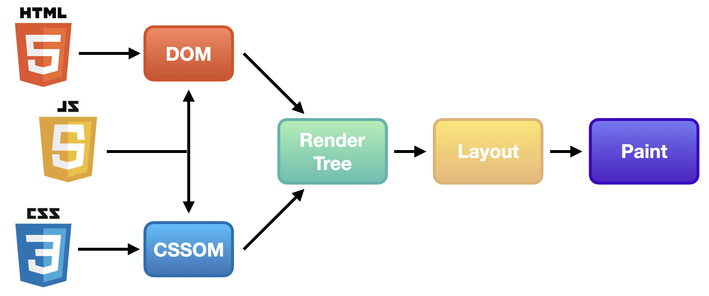

## 1. 브라우저의 렌더링 과정

**IP 주소 취득**

1. 검색창에 www.google.com을 입력하면 입력한 URL 주소 중, 도메인 이름에 해당하는 google.com가 캐싱 되어있나 확인 1-1. 도메인 이름에 맞는 IP 주소가 존재하면 바로 IP 주소를 반환 1-2. 도메인 이름에 맞는 IP 주소가 존재하지 않는다면 DNS 서버에 IP 주소 요청

2. 전달받은 IP 주소를 이용해 웹 브라우저는 웹 서버에게 해당 웹 사이트에 맞는 HTML 문서 요청 2-1. 이때, 웹서버는 정적인 데이터를 클라이언트로 바로 돌려줄 수 있으나, 동적인 데이터는 was로 요청함

**렌더트리 생성**

1. 브라우저 렌더링 엔진은 응답받은 HTML 문서를 파싱하여 브라우저가 이해할 수 있는 자료구조인 DOM 형태로 전환
   - 바이트 -> 문자 -> 토큰 -> 노드 -> 객체
2. 브라우저 렌더링 엔진은 HTML을 한 줄씩 파싱하다가 CSS를 로드하는 link나 script 태그를 만나면 DOM 생성을 중단하고 CSS 또한 HTML과 동일한 방식으로 파싱하여 CSSOM 트리로 전환
3. DOM 트리와 CSSOM 트리를 결합해 렌더트리 생성
   - 렌더트리는 실제 화면에 그려지는 트리라서 **`display : none`** 인 경우 렌더트리에 포함되지 않음

**AST 생성**

1. 브라우저 렌더링 엔진은 HTML을 한 줄씩 파싱하다가 자바스크립트 코드를 로드하는 script 태그를 만나면 DOM 생성을 중단하고 자바스크립트 파일을 서버에 요청하여 받아온 뒤 자바스크립트 엔진에게 제어권을 넘김
2. 자바스크립트 엔진은 DOM 과 CSSOM을 생성하는것처럼 JS를 해석해 AST(Abstract Syntax Tree, 추상적 구문 트리)를 생성
3. JS 파싱과 실행이 완료되면 렌더링 엔진에게 제어권이 넘어와 DOM 생성을 재개
4. 보통 렌더트리가 만들어진 후 AST가 만들어진다.

**Layout(렌더트리 배치)**

1. 생성된 렌더트리를 참고하여 각 객체들의 정확한 위치와 크기를 계산
   - 이 과정에서 **`%`** 단위가 **`PX`** 로 변환됨
2. 만약 AST를 생성하는 과정에서 DOM이나 CSS를 바꾸는 DOM API가 사용 됐다면 렌더트리가 변경되어 레이아웃을 다시하는 **`reflow`** 가 진행

**Paint(렌더트리 그리기)**

1. 확정된 렌더트리를 기반으로 **`repaint`** 하여 실제 화면에 출력

---

**요약**

- 브라우저의 렌더링 과정은 위와 같으며 AST를 구축한은 과정에서 DOM에 영향을 미친다면 위 과정이 다시 일어난다.
- 이러한 과정을 **Critical Rendering Path(CRP, 중요 렌더링 경로)** 라고 한다.

**리페인트와 리플로우가 실행되는 시점**

- **리플로우(reflow)**
  - Layout 단계에서 수정이 있을 때 발생
  - 요소에 기하학적인 영향을 주는 CSS 속성값을 변경할때 발생
  - ex) **DOM 노드의 추가/제거, DOM 노드의 위치/크기 변경 (`width`, `margin`, `border`등), Window 창 크기 조절** (위치/크기 값이 상대 값일 경우), **CSS 애니메이션, 계산된 css 정보 (offset, scrollTop 등)**
- **리페인트 (repaint)**
  - Paint 단계에서 수정이 있을 때 발생
  - 리플로우가 발생하면 리페인트가 필연적으로 실행됨
  - 요소에 기하학적인 영향을 주지 않는 CSS 속성값을 변경할 때 발생
  - **ex) `background`, `color`, `text-decoration`, `border-style`, `border-radius`**
- **리플로우 최적화 방법**
  - 애니메이션이 들어간 노드는 가급적 **`position : fixed`** 또는 **`position : absolute`** 로 지정하여 전체 노드에서 분리
  - 안쓰는 노드의 속성은 **`display : none`** 해 렌더 트리에서 제외

 

## 2. BOM(Browser Object Model)이란?

**DOM(Document Object Model, 문서 객체 모델)**

- HTML 문서의 구조를 브라우저가 이해할 수 있도록 구성한 트리자료구조
- 웹 페이지를 제어할 수 있는 프로퍼티들과 메서드(API)를 제공한다.

**BOM(Browser Object Model, 브라우저 객체 모델)**

- 브라우저, 윈도우를 제어할 수 있는 객체들의 집합
- **`location`** , **`navigator`** , **`document`** , **`screen`** , **`history`** 를 하위 객체로 갖는다.

 

## 3. SPA, MPA, CSR, SSR의 차이

**MPA/SPA : 웹 어플리케이션이 구성된 형태**

- **MPA(Multi Page Application)**
  - 다수의 페이지로 구성되어 요청마다 정해진 페이지를 반환함
- SPA(single Page Application)
  - 단일페이지로 구성되어 요청마다 화면을 재구성한다.(수정한다)

**SSR/CSR : 렌더링방식**

- **SSR(Server Side Rendering)**
  - HTML 문서가 서버에서 렌더링되는 방식. 이미 하드코딩된 정적페이지를 서버에서 렌더링 하고 최종적인 문서를 브라우저에게 전달하여 화면에 띄워준다
  - 첫 페이지 로딩시간이 상대적으로 짧고, 완성된 HTML 문서가 전달되므로 SEO를 적용하기에 좋고, 사용자의 정보를 서버에서 관리하므로 보안에 좋음
  - 각 페이지별로 매번 로딩시간이 생기고 새로고침된다
- **CSR(Client Side Rendering)**
  - HTML 문서가 Client 에서 렌더링 되는 방식. 빈 HTML파일을 서버로부터 전달받아 렌더링에 필요한 요소(js나 css)들을 클라이언트(브라우저)에서 렌더링한다-> 사용자가 빈 화면을 오래 볼수도 있음
  - 초기 로딩 속도를 제외하면 매우 빠른 인터렉션 속도를 보여줌(이미 다운받은 번들링된 JS파일에 렌더링에 필요한 모든 로직이 들어있기 때문)
  - 새로고침이나 화면 깜빡임이 발생하지 않으며 서버단과 일이 분리됨

 

## 4. CORS 정의 및 목적

**Origin(출처)**

- 프로토콜, 도메인, 포트번호 3가지를 합쳐 Origin이라고 한다.
- 브라우저 개발자 도구 콘솔에서 console.log(location.origin) 로 출처를 알아낼 수 있다.

**CORS(Cross-Origin Resource Sharing)**

- 교차 출처 리소스 공유 정책으로 서로 다른 출처에서 리소스를 공유하는것에 대한 정책으로 브라우저에 의해 실행됨
- 서로 다른 출처의 리소스 접근 권한을 정리해놓은 정책
- 악의를 가진 모방 사이트가 접근하는걸 막기 위해 만들어졌다.

**CORS 에러 대응하는법**

1. 프록시 서버 사용하기
2. **서버에서 `Access-Control-Allow-Origin` 응답 헤더 세팅하기**

 

## 5. 웹 접근성을 높이기 위한 방법은 어떤 것들이 있을까요?

## 6. 검색 엔진 최적화(Search Engine **O**ptimization, SEO)에 대해 알고 있나요?

## 7. 이벤트

## 8. 쿠키/세션/토큰

## 9. 성능
